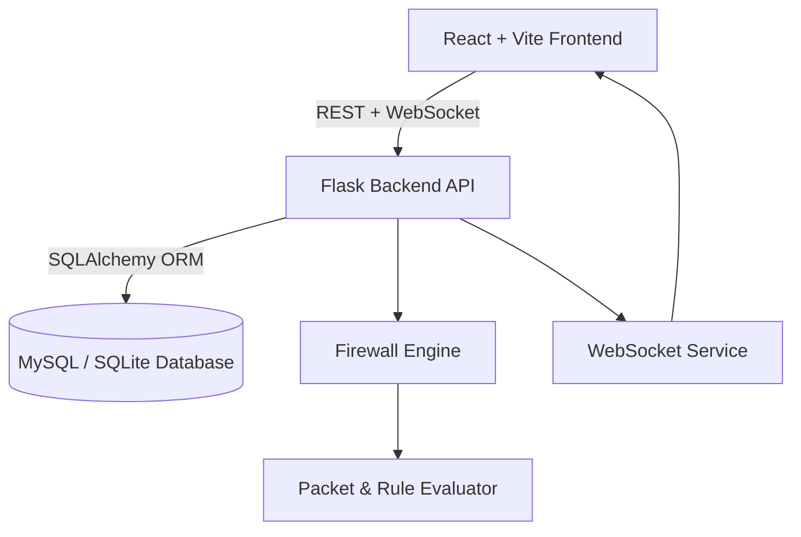

# 🔥 FirewallX

> **A Real-Time Firewall Simulation and Visualization Platform**
> Full-Stack Application by **[@adbranches](https://github.com/adbranches)**
> Built with **Flask (Backend)** + **React + TypeScript + Vite (Frontend)**

---

## 🧠 Project Overview

**FirewallX** is a comprehensive **network security simulation suite** that allows developers, students, and researchers to:

* Observe **live packet flow** in a controlled environment.
* Apply and test **firewall rules** dynamically.
* Visualize **traffic decisions** (`ALLOW` / `BLOCK`) in real-time.
* Understand core **network filtering concepts** through a modern, interactive UI.

> ⚡ The goal: simplify learning and experimentation with firewall logic using modern web technologies.

---

## 🏗️ System Architecture



* **Frontend (Port 5173)** — Interactive dashboard built in React + TypeScript.
* **Backend (Port 5001)** — Flask API serving rules, logs, and WebSocket events.
* **WebSocket Bridge** — Streams packet simulation data to all connected clients.
* **Database** — Stores firewall rules, packets, and decision logs.

---

## 🧩 Repository Structure

```
firewallx/
├── backend/          # Flask backend (REST + WebSocket)
│   ├── app.py
│   ├── services/
│   ├── routes/
│   ├── models/
│   ├── utils/
│   └── README.md
│
├── frontend/         # React + TypeScript + Vite client
│   ├── src/
│   ├── public/
│   ├── vite.config.ts
│   └── README.md
│
├── LICENSE
└── README.md         # ← You are here
```

---

## ⚙️ Quick Start

### 🧰 Prerequisites

Make sure you have installed:

* **Python 3.10+**
* **Node.js 18+**
* **npm** or **yarn**
* **MySQL** (or SQLite for local use)

---

### 🐍 Backend Setup

```bash
# Clone repository
git clone https://github.com/adbranches/firewallx.git
cd firewallx/backend

# Create environment & install deps
python3 -m venv venv
source venv/bin/activate
pip install -r requirements.txt

# Run the backend
python3 app.py
```

Backend runs at **[http://localhost:5001](http://localhost:5001)**

---

### ⚛️ Frontend Setup

```bash
cd ../frontend
npm install
npm run dev
```

Frontend runs at **[http://localhost:5173](http://localhost:5173)**

---

## 🔗 Communication Flow

| Channel       | Protocol  | Description                         |
| ------------- | --------- | ----------------------------------- |
| `/api/*`      | HTTP REST | Rules, packets, and logs endpoints  |
| `/ws`         | WebSocket | Real-time packet simulation updates |
| `/api/health` | GET       | Backend health check                |

> The Vite dev server proxies `/api` and `/ws` calls automatically to the Flask backend.

---

## 🧪 Simulation Flow

1. Start backend (`app.py`)
2. Run frontend (`npm run dev`)
3. Visit **Simulator → Start Simulation**
4. Watch packets appear live in **Dashboard** and **Logs**
5. Modify **Rules** to see instant changes in packet decisions

---

## 🧱 Core Components

### Backend

* `app.py` – Flask app factory + WebSocket init
* `services/websocket_service.py` – Real-time simulation
* `services/firewall_engine.py` – Core decision logic
* `models/*.py` – ORM models for rules, packets, logs

### Frontend

* `src/context/PacketContext.tsx` – Manages packet & WebSocket state
* `src/pages/Simulator.tsx` – Start/Stop simulation UI
* `src/pages/RuleManager.tsx` – CRUD interface for firewall rules
* `src/pages/Logs.tsx` – Real-time decision log viewer

---

## 📸 UI Preview

*(If screenshots are added, they render here)*

```
+-----------------------------------------------------------+
| [Navbar] FirewallX  | Dashboard | Simulator | Rules | Logs |
+-----------------------------------------------------------+
| Packets Processed: 54   | Simulation: Running (2s)       |
|-----------------------------------------------------------|
| Packet Flow Visualization (WebSocket live updates)       |
|-----------------------------------------------------------|
| Logs: ALLOW tcp:443 → 10.0.0.1 (Rule #2: Allow HTTPS)    |
+-----------------------------------------------------------+
```

---

## 🧑‍💻 Contributing

We welcome all contributions from students, cybersecurity enthusiasts, and developers!

### Steps:

1. **Fork** the repository
2. **Create a feature branch**

   ```bash
   git checkout -b feature/add-dashboard-graph
   ```
3. **Commit changes**

   ```bash
   git commit -m "Added traffic graph to Dashboard"
   ```
4. **Push & Open a Pull Request**

### Contribution Guidelines

* Follow **PEP8** for Python and **ESLint + Prettier** for React.
* Write meaningful commit messages.
* Include screenshots or logs for UI changes.

---

## 🧰 Troubleshooting

| Symptom                                          | Likely Cause                            | Solution                              |
| ------------------------------------------------ | --------------------------------------- | ------------------------------------- |
| `WebSocket closed before connection established` | Backend not started yet                 | Start Flask backend first             |
| `Backend Disconnected` alert in UI               | `/api/health` not reachable             | Verify Flask port & proxy config      |
| `No packets showing`                             | Simulation not started                  | Click “Start Simulation”              |
| `[No Flask Context]` logs                        | Simulation thread outside Flask context | Safe to ignore or wrap in app context |

---

## 🧾 License

This project is licensed under the **MIT License**.
You are free to use, modify, and distribute it with attribution.

---

## 👥 Credits

| Role                      | Name                                                |
| ------------------------- | --------------------------------------------------- |
| 💡 Lead Developer         | **Edwin Bwambale (@adbranches)**                    |
| 🧠 Concept & Architecture | FirewallX Research Group @ UTAMU                    |
| 🧰 Backend                | Flask + SQLAlchemy + Flask-Sock                     |
| 🎨 Frontend               | React + TypeScript + Tailwind + Vite                |
| 🌍 Institution            | Uganda Technology and Management University (UTAMU) |

---

## 🌟 Acknowledgments

Special thanks to:

* **GDSC UTAMU** – for fostering student developer innovation
* **IEEE Xtreme & CyberStars communities** – for inspiring real-world security problems
* **Open Source contributors** – for testing, debugging, and extending FirewallX

---

## 📬 Contact

For inquiries, collaborations, or mentorship:

* GitHub → [@adbranches](https://github.com/adbranches)
* LinkedIn → [linkedin.com/in/adbranches](https://linkedin.com/in/adbranches)
* Email → **[adbranches.dev@gmail.com](mailto:adbranches.dev@gmail.com)**

---

**FirewallX © 2025** — *Real-time Firewall Simulation for Modern Security Learning*

---
